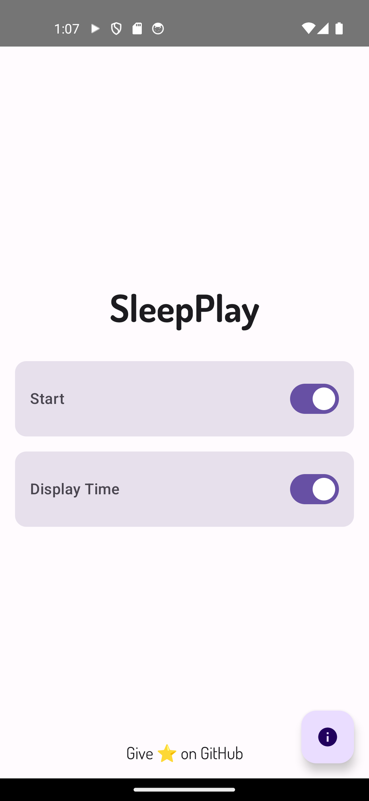
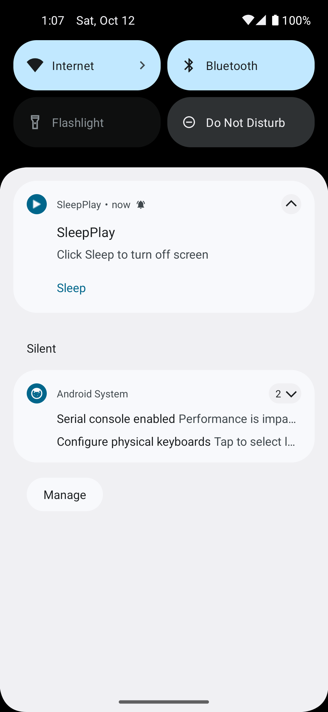
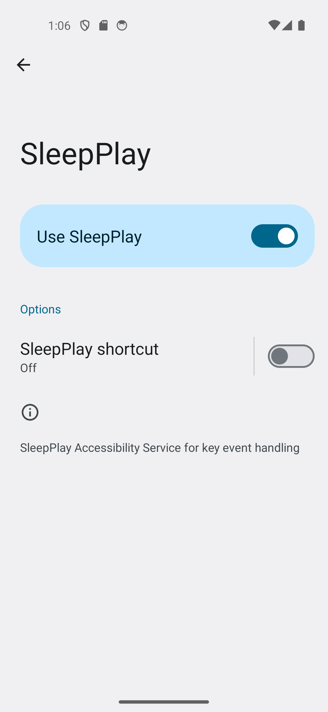
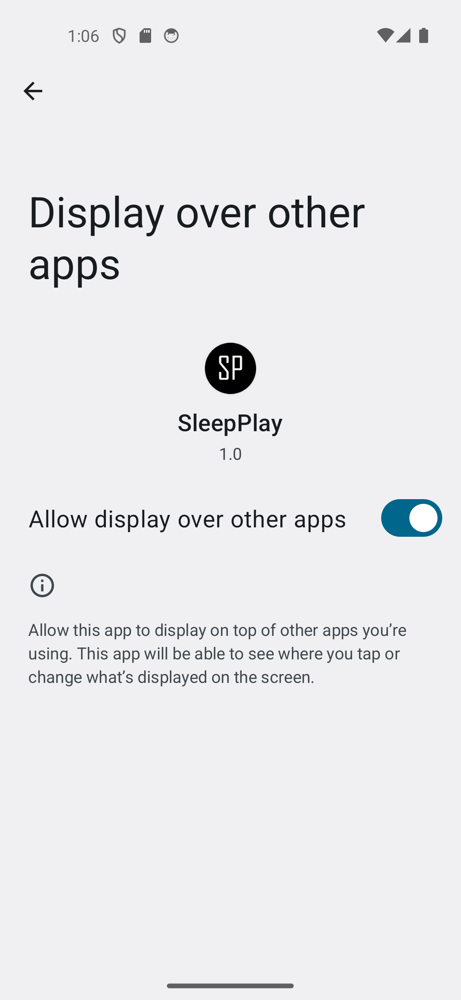

# SleepPlay

**SleepPlay** is an Android application built using **Kotlin** and **Jetpack Compose**, allowing users to continue playing videos in the background even when the screen is turned off. This is especially useful for activities such as listening to podcasts or music, where you want to save battery by turning off the screen while still enjoying the content.

## Features

- Play videos and audio in the background with the screen turned off.
- Save battery while listening to content or performing other tasks.
- Quick screen on/off functionality using the volume up button.
- Easy-to-use permissions system for overlay, notifications, and accessibility.

## Background

In **Android 14**, a feature called "Background Stream" was introduced, enabling users to play content in the background with the screen turned off. However, this feature was removed in a later update. **SleepPlay** was created to bring back this functionality, allowing users to enjoy uninterrupted playback in a convenient way.

## How It Works

1. **Permissions**: To enable SleepPlay, the app requires the following permissions:
    - **Display over other apps**: To manage content playback while the screen is off.
    - **Notifications**: For control and playback notifications.
    - **Accessibility**: To manage the device state, like turning the screen on or off.
   
2. **Using SleepPlay**:
    - Play any video or audio content.
    - Once the content is playing, turn off the screen to save battery. The content will continue playing in the background.
    - To turn the screen back on, simply press the **volume up** button.

## Permissions Setup

To ensure smooth functioning of SleepPlay, you will need to manually grant the following permissions:

1. **Display Over Other Apps**: 
   - Navigate to **Settings** > **Apps** > **Special App Access** > **Display Over Other Apps**.
   - Find and enable permission for SleepPlay.

2. **Notifications**:
   - Navigate to **Settings** > **Notifications**.
   - Enable notifications for SleepPlay to receive playback control alerts.

3. **Accessibility**:
   - Navigate to **Settings** > **Accessibility**.
   - Find and enable SleepPlay under the accessibility settings.

## How to Turn On the Screen

When the screen is off, simply press the **volume up** button to turn it on without interrupting your content.

## Screenshots

| Home Screen | Notifications | Working | Permission | Permission |
|:-----------:|:------------------:|:-----------:|:------------------:|:------------------:|
|  |  |  |  |  |

## Tech Stack

- **Kotlin**
- **Jetpack Compose**
- **Android Accessibility Services**

## Installation

1. Clone the repository:
   ```bash
   git clone https://github.com/mukundsolanki/SleepPlay.git
   ```

2. Open the project in Android Studio.
3. Build and run the project on an Android device.

## Contributions

Feel free to submit issues and pull requests if you'd like to contribute to SleepPlay.
